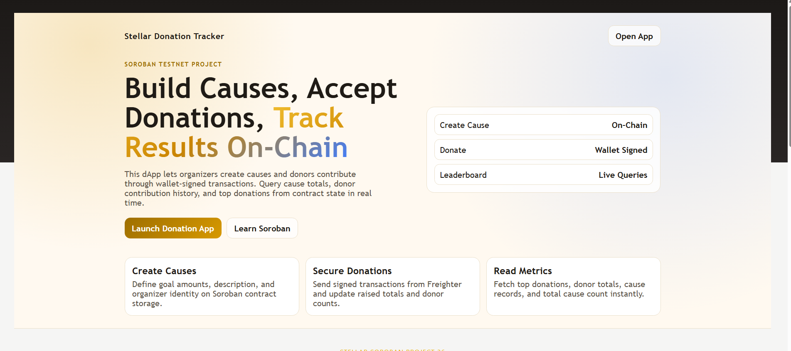
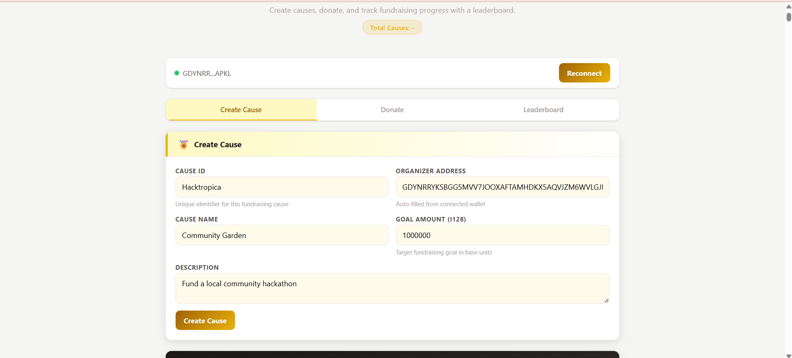
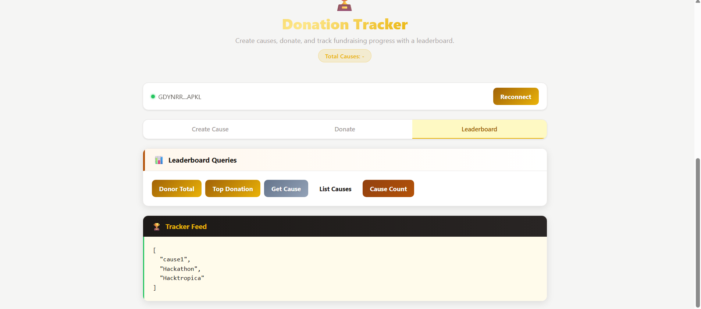

# Stellar Donation Tracker (Soroban)

A React + Vite App for creating donation causes, donating with Freighter, and querying leaderboard-style stats from a Soroban smart contract on Stellar Testnet.

**Contract Address** - https://stellar.expert/explorer/testnet/contract/CBYFN32STXT2F3UPOL5EMROGFV46F6DP3QLODDR7GKYDETWFU2D2APY3

## Table of Contents

- [What This App Does](#what-this-app-does)
- [Screenshots](#screenshots)
- [Tech Stack](#tech-stack)
- [Project Structure](#project-structure)
- [Frontend Flow](#frontend-flow)
- [Contract + Client API Mapping](#contract--client-api-mapping)
- [Network Configuration](#network-configuration)
- [Prerequisites](#prerequisites)
- [Run Frontend](#run-frontend)
- [Build/Test Contract](#buildtest-contract)
- [How To Use](#how-to-use)
- [Notes](#notes)
- [Troubleshooting](#troubleshooting)

## What This App Does

- Connects to Freighter wallet and reads the active public key.
- Creates causes with organizer, name, description, and goal amount.
- Sends donation transactions to a selected cause.
- Reads contract state for:
	- Cause by id
	- List of cause ids
	- Donor total for a cause
	- Top donation per cause
	- Total cause count

## Screenshots

### 1. Landing Hero and Feature Highlights

Shows the landing section in index.html with:
- Hero headline and CTA buttons ("Launch Donation App", "Learn Soroban")
- Right-side contract highlight panel (Create Cause, Donate, Leaderboard)
- Three feature cards (Create Causes, Secure Donations, Read Metrics)



### 2. Create Cause Tab with Connected Wallet

Shows the app in the Create Cause tab with:
- Connected wallet bar and reconnect button
- Cause form fields (cause id, organizer address, cause name, goal amount, description)
- Create Cause submit action



### 3. Leaderboard Queries and Tracker Feed Output

Shows the app in the Leaderboard tab with:
- Query buttons (Donor Total, Top Donation, Get Cause, List Causes, Cause Count)
- Tracker Feed panel displaying query output (list of cause ids)
- Connected wallet status and active Leaderboard tab state



## Tech Stack

- Frontend: React 19 + Vite
- Wallet: @stellar/freighter-api
- Chain SDK: @stellar/stellar-sdk
- Contract: Soroban (Rust, no_std)

## Project Structure

```text
.
├─ index.html
├─ src/
│  ├─ main.jsx
│  ├─ App.jsx
│  ├─ App.css
│  └─ index.css
├─ lib/
│  └─ stellar.js
└─ contract/
	 ├─ Cargo.toml
	 └─ contracts/
			└─ hello-world/
				 ├─ Cargo.toml
				 ├─ Makefile
				 └─ src/
						└─ lib.rs
```

## Frontend Flow

1. Landing section is rendered in index.html.
2. React app mounts in the root element and renders App.jsx.
3. App tabs:
	 - Create Cause
	 - Donate
	 - Leaderboard
4. Actions call lib/stellar.js, which signs write transactions through Freighter and simulates read calls through Soroban RPC.

## Contract + Client API Mapping

Contract methods in Rust (contract/contracts/hello-world/src/lib.rs):

- create_cause(id, organizer, name, description, goal_amount)
- donate_to_cause(cause_id, donor, amount, message)
- get_cause(id) -> Option<Cause>
- list_causes() -> Vec<Symbol>
- get_donor_total(cause_id, donor) -> i128
- get_top_donation(cause_id) -> i128
- get_cause_count() -> u32

Client functions in lib/stellar.js:

- createCause(payload)
- donateToCause(payload)
- getCause(id)
- listCauses()
- getDonorTotal(causeId, donor)
- getTopDonation(causeId)
- getCauseCount()

## Network Configuration

Configured in lib/stellar.js:

- RPC URL: https://soroban-testnet.stellar.org
- Network passphrase: Stellar Testnet
- Contract ID: CBYFN32STXT2F3UPOL5EMROGFV46F6DP3QLODDR7GKYDETWFU2D2APY3
- Demo read address: GDYNRRYKSBGG5MVV7JOOXAFTAMHDKX5AQVJZM6WVLGJIENN5FT2MAPKL

## Prerequisites

- Node.js 18+ (or newer LTS)
- npm
- Freighter wallet browser extension
- A Stellar testnet account in Freighter

Optional for contract build/test:

- Rust toolchain
- Soroban CLI (stellar)

## Run Frontend

```bash
npm install
npm run dev
```

Other scripts:

```bash
npm run build
npm run preview
npm run lint
```

## Build/Test Contract

From contract/contracts/hello-world:

```bash
make build
make test
```

Equivalent direct commands:

```bash
stellar contract build
cargo test
```

## How To Use

1. Open the app in browser.
2. Click Connect Wallet.
3. In Create Cause tab, submit a cause.
4. In Donate tab, donate to an existing cause id.
5. In Leaderboard tab, query donor totals, top donation, cause list, and cause count.

## Notes

- Write calls require Freighter authorization and signature.
- Read calls use simulation against Soroban RPC.
- Amount fields are passed as i128 values; use integer base units.

## Troubleshooting

- Wallet not connected:
	- Ensure Freighter is installed and unlocked.
	- Approve site access in Freighter.
- Transaction signing failed:
	- Confirm the active account and network in Freighter.
- Read simulation failed:
	- Verify contract id and testnet RPC availability.

